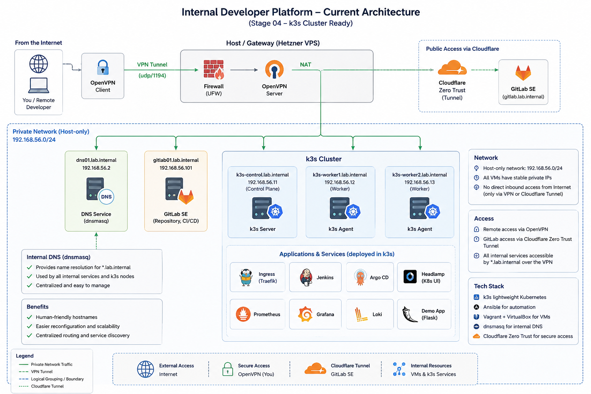

# Building an Internal Developer Platform from Scratch

> A step-by-step guide to building a production-inspired private infrastructure for a small software company using open-source technologies. The series covers secure networking, GitLab, Kubernetes, GitOps, observability, CI/CD, infrastructure automation, and supporting platform services.

The goal of this lab series is to emulate a real-world infrastructure stack of a small IT company on VMs for learning and practicing services.

It will include:
- private network with VPN access
- local DNS
- k3s cluster
- GitLab server with CI/CD pipelines
- GitLab runner server
- ephemeral GitLab runners on k3s
- infrastructure as code
- observability
- GitOps deployment pipeline using Argo CD
and more...

---

## Prerequisites

- server capable to run multiple VMs
- Vagrant
- Virtualbox
- Ansible

On the host:
```bash
# install ansible if not present
which ansible || (sudo apt-get update -y && sudo apt-get install -y ansible)

# install Vagrant and VirtualBox if not installed
cd lab-infra
ansible-playbook playbooks/host-prerequisites.yml
```

---

## Project architecture

Current architecture:


- Host runs Vagrant + Ansible.
- DNS node serves lab.internal records.
  - DNS is a dependency for stable service naming.
- K3S control-plane and workers on private network.
  - Host kubectl accesses cluster via fetched kubeconfig artifact.

**Node addresses and roles**
| Host         | IP address     | Service role             |
| ------------ | -------------- | ------------------------ |
| dns01        | 192.168.56.2   | Internal DNS             |
| k3s01-ctrl01 | 192.168.56.11  | K3S server/control-plane |
| k3s01-wrk01  | 192.168.56.12  | K3S worker               |
| k3s01-wrk02  | 192.168.56.13  | K3S worker               |

**Ansible groups**:
- local
- lab
  - dns
  - k3s01
    - k3s01_servers
    - k3s01_agents

---

## Infrastructure setup

On the host:
```bash
cd lab-infra

# deploy/turn on all VMs
vagrant up

# deploy particular vm
vagrant up dns01

# verify connection: all VMs
ansible lab -m ping -o

# verify connection: group of VMs
ansible dns -m ping -o

# verify connection: single VM
ansible dns01 -m ping -o

# deploy a role VM or VMs (see the role's handbook in docs folder)
# deploy DNS VM(s)
ansible-playbook playbooks/dns.yml
```

**Recommended order**

| Tech/Tool | Docfile    | Playbook         | Implemented  | Link to implementation |
| --------- | ---------- | ---------------- | ------------ | ---------------------- |
| DNS       |  dns.md    | dns.yml          | in this repo | [030-dns-service](https://github.com/ic-devops-lab/internal-devops-platform/tree/030-dns-service) |
| OpenVPN   | openvpn.md | host_openvpn.yml | in this repo | [025-openvpn](https://github.com/ic-devops-lab/internal-devops-platform/tree/025-openvpn) |
| firewall  | openvpn.md | host_openvpn.yml | in this repo | [025-openvpn](https://github.com/ic-devops-lab/internal-devops-platform/tree/025-openvpn) |
| GitLab SE |            |                  | in ext.repo  | 1. [GitLab SE behind Cloudflare Zero Trust](https://github.com/ic-devops-lab/devops-labs/blob/main/GitLabSE-behind-CloudFlare/readme.md) 2. [GitLab SE behind Cloudflare Zero Trust: Part 2. Introducing the Tunnels](https://github.com/ic-devops-lab/devops-labs/blob/main/GitLabSEBehindCloudflare02Tunnels/readme.md) |
| K3S       | k3s.md     | k3s.yml          | in this repo | [040-k3s-cluster] (https://github.com/ic-devops-lab/internal-devops-platform/tree/040-k3s-cluster) |
|           |            |                  |              |                        |

---

## Implementation

### Internal DNS Service

**Promlem to solve**: once your project has grown to the point where you're starting to add and remove services, scale them, replicate or move between the hosts, it becomes difficult to manage and maintain your services using just IP addresses.

And this is where an internal DNS could be an essential component of your infrastructure.

**Benefits**:
- *meaningful service names instead of IP addresses*: administrators and automation tools can reference services such as `gitlab01.lab.internal`, `grafana.lab.internal`, rather than memorizing internal IP addresses;
- *decoupling services from network addressing*: we might use our database (for example `db01.lab.internal`) in several services, in all of them we use the database domain name in configurations, and in case we move our database to another server, or make it scalable with replica set, we don't need to edit all those configuration files of our services, we just need to update our DNS configuration;
- *better infrastructure as code integration*: DNS records become part of the infrastructure repository and are managed by Ansible together with the rest of the platform. Rebuilding the environment from scratch automatically recreates the DNS configuration;
- *centralized routing configuration*: we keep our map of relations between domain names and network addresses in a single place.

See [the step-by-step guide for deploying the DNS service](./docs/dns.md).

---

### OpenVPN

> This repo includes automation for the OpenVPN service. Manual setup has been described in [Securing a Remote Linux Host with firewalld and OpenVPN](https://github.com/ic-devops-lab/devops-labs/tree/main/ProtectRemoteHostWithFirewallAndVPN)

**Problem to solve**: providing secure remote access to internal lab services without exposing them directly to the Internet.

**Benefits**:
- *secure access to private infrastructure*: remote users can reach services such as `dns01.lab.internal` and `k3s01-ctrl01.lab.internal` through the VPN;
- *split-tunnel networking*: normal internet traffic stays local while the lab subnet is routed over the VPN;
- *repeatable certificate lifecycle*: PKI, server identity, and client profiles are managed as code with Ansible.

**Implementation steps**
- adding OpenVPN PKI and server configuration roles for the host;
- creating the Ansible playbook to install and configure the VPN service;
- preserving existing PKI state and client certificates while allowing new clients to be issued on demand;
- validating access to the private network through the VPN tunnel.

---

### Firewall

> This repo includes automation for the host firewall and VPN routing setup. Manual setup has been described in [Securing a Remote Linux Host with firewalld and OpenVPN](https://github.com/ic-devops-lab/devops-labs/tree/main/ProtectRemoteHostWithFirewallAndVPN)

**Problem to solve**: securing the host facing the Internet while controlling access to public and private resources.

**Benefits**:
- *restricted public exposure*: only HTTP/HTTPS and OpenVPN are allowed on the public interface;
- *least-privilege access*: SSH is available via VPN and optional admin fallback addresses only;
- *safe lab access*: VPN traffic is routed to the private lab network with controlled SNAT and policy-based filtering.

**Implementation steps**
- adding `firewalld` zones for `public`, `vpn`, `lab`, and `admin-fallback`;
- enabling forwarding and policy-based routing from VPN clients to the `192.168.56.0/24` network;
- creating the `host_firewall` role and startup automation for permanent firewall configuration;
- integrating the firewall setup with the OpenVPN infrastructure playbook.

---

### K3S Cluster

**Problem to solve**: once your infrastructure grows beyond a handful of services running directly on VMs, managing deployments, scaling, and restarts becomes manual and error-prone. Running containers without orchestration means no automatic recovery from failures, no consistent resource limits, and no unified way to expose or update services.

And this is where a lightweight Kubernetes cluster becomes an essential component of the platform.

**Benefits**:
- *automated workload scheduling and recovery*: the cluster scheduler places containers on available nodes and restarts them on failure, removing the need for manual intervention;
- *declarative service definitions*: all applications and their configuration are described in version-controlled manifests, making the platform reproducible and auditable;
- *unified networking and service discovery*: services communicate by name within the cluster, and Ingress exposes them externally through a single entry point;
- *foundation for GitOps*: a running cluster is the prerequisite for Argo CD, which drives all subsequent application deployments from Git.

**Implementation steps**
- adding 3 VMs for k3s cluster nodes to Vagrantfile
- adding new VMs to Ansible inventory
- updating list of hosts in DNS configuration
- creating Ansible roles for the k3s cluster
  - k3s-common
  - k3s-server
  - k3s-agent
- creating an Ansible playbook for automated deployment of the cluster
- creating a playbook for uninstalling cluster agent ans servers
- creating a standalone playbook for (re-)installing Helm: `playbooks/k3s-helm.yml`

---